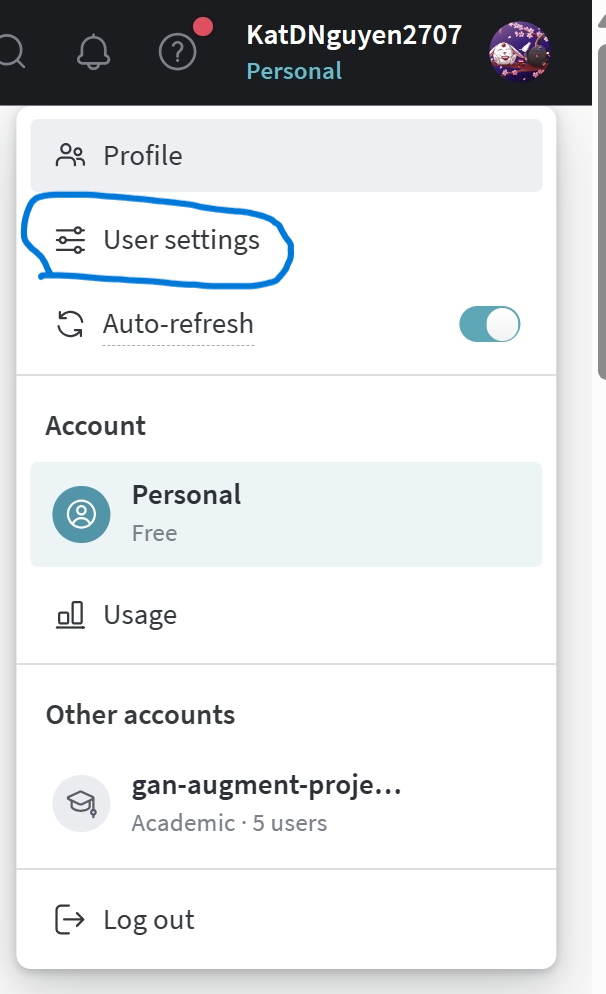
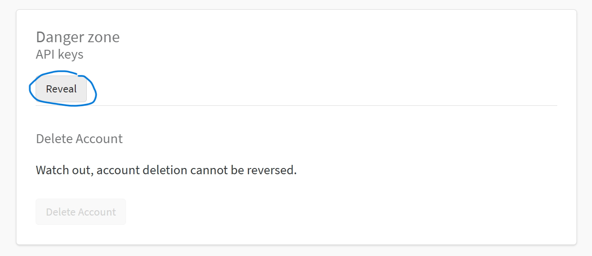

# Learning to Perturb Word Embeddings for Out-of-distribution QA
This is the customize Pytorch implementation of the paper **Learning to Perturb Word Embeddings for Out-of-distribution QA** (**ACL 2021**): [[Paper]](https://arxiv.org/abs/2105.02692) for pretraining purpose

## Abstract


QA models based on pretrained language mod-els have achieved remarkable performance onv arious benchmark datasets.However, QA models do not generalize well to unseen data that falls outside the training distribution, due to distributional shifts.Data augmentation (DA) techniques which drop/replace words have shown to be effective in regularizing the model from overfitting to the training data.Yet, they may adversely affect the QA tasks since they incur semantic changes that may lead to wrong answers for the QA task. To tackle this problem, we propose a simple yet effective DA method based on a stochastic noise generator, which learns to perturb the word embedding of the input questions and context without changing their semantics. We validate the performance of the QA models trained with our word embedding perturbation on a single source dataset, on five different target domains.The results show that our method significantly outperforms the baselineDA methods. Notably, the model trained with ours outperforms the model trained with more than 240K artificially generated QA pairs.

__Contribution of this work__
- We propose a simple yet effective data augmentation method to improve the generalization performance of pretrained language models for QA tasks.
- We show that our learned input-dependent perturbation function transforms the original input without changing its semantics, which is
crucial to the success of DA for question answering.
- We extensively validate our method for domain generalization tasks on diverse datasets,
on which it largely outperforms strong baselines, including a QA-pair generation method.


## Dependencies
This code is written in Python. Install dependencies with the command 
```bash
pip install -r requirements.txt
```

## Get wandb api key
Follow the step.
- Step 1:

- Step 2:

- Step 3: Copy the api key to config "--wandb_api_key" in the training section.

## How to train the model
```bash
python run_variational_wwm.py --tokenizer_name "bert-base-uncased" --model_type "bert" --log_steps 50 --eval_steps 50 --per_gpu_eval_batch_size 4 \
--wandb_api_key <wandb/api/key> --dataset_name 'wikipedia' --dataset_config_name "20220301.simple" --do_train --output_dir='results' 
```
- You can adjust others parameters as specified in  "run_variational_wwm/ModelArguments" to see the change in performance.

## Evaluation of the other dataset

```bash
python eval_shift.py --ckpt_file "model checkpoint" --output_dir "directory for evaluation result"
```
 
